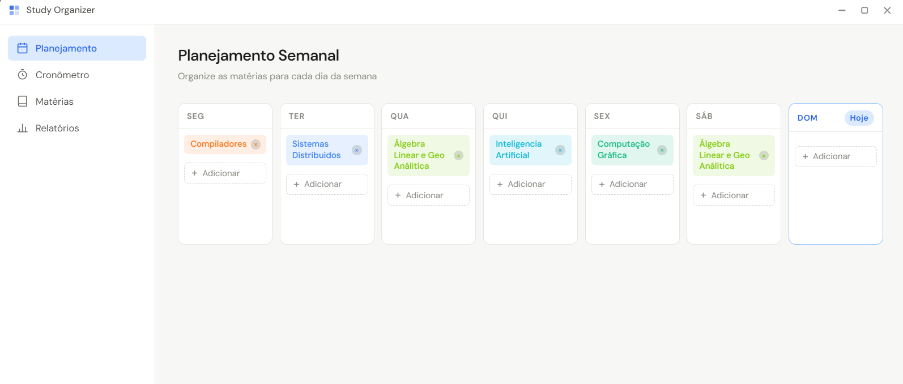
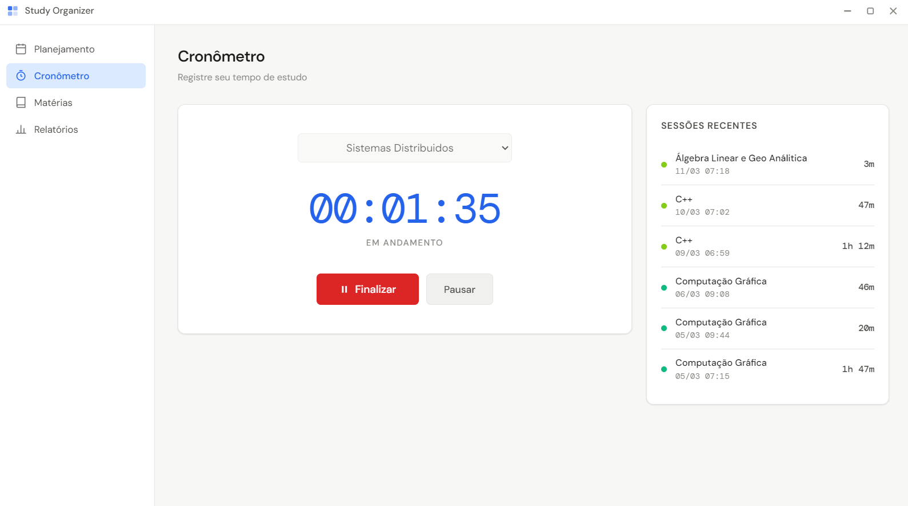
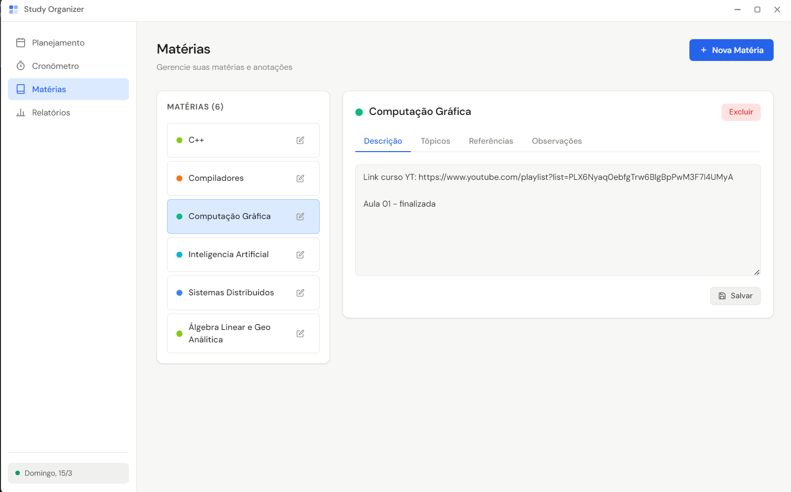
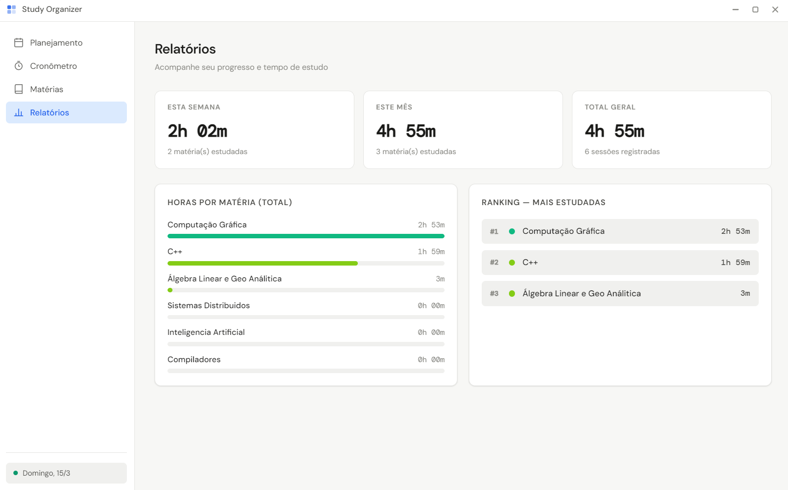

<div align="center">

# 📚 Study Organizer

**Aplicativo desktop para organização e controle de estudos**

Tracking de estudos com acompanhamento diario, semanal e mensal.


</div>

---

## ✨ Funcionalidades

- **📅 Planejamento Semanal** — monte seu calendário da semana atribuindo matérias a cada dia

- **⏱️ Cronômetro de Estudos** — inicie, pause e finalize sessões com registro automático de tempo (`HH:MM:SS`)

- **📝 Notas por Matéria** — salve descrição, tópicos, referências e observações para cada matéria

- **📊 Dashboard de Métricas** — gráfico de barras, ranking das matérias mais estudadas e totais por semana, mês e geral


---

## 🖥️ Pré-requisitos

- [Node.js](https://nodejs.org/) **18 ou superior**
- npm
- Git

---

## 🚀 Como clonar e rodar

**1. Clone o repositório**
```bash
git clone https://github.com/SEU_USUARIO/study-organizer.git
cd study-organizer
```

**2. Instale as dependências**

> O `npm install` já recompila automaticamente o `better-sqlite3` para o Electron via `electron-rebuild`.

```bash
npm install
```

**3. Inicie o aplicativo**
```bash
npm start
```

**Modo desenvolvimento** (com DevTools aberto):
```bash
npm run dev
```

---

## 🗂️ Estrutura do Projeto

```
study-organizer/
├── src/
│   ├── main/
│   │   ├── main.js          # Processo principal do Electron + handlers IPC
│   │   ├── preload.js       # Bridge segura via contextBridge
│   │   └── database.js      # Camada de dados com better-sqlite3
│   └── renderer/
│       ├── index.html       # Shell HTML da aplicação
│       ├── app.js           # Lógica do renderer (roteamento + 4 páginas)
│       └── assets/
│           └── styles.css   # UI completa (design system minimalista)
├── resources/               # Ícones e assets estáticos
├── .gitignore
├── package.json
└── README.md
```

---

## 🛠️ Stack

| Tecnologia | Uso |
|---|---|
| [Electron 28](https://www.electronjs.org/) | Shell desktop multiplataforma |
| [better-sqlite3](https://github.com/WiseLibs/better-sqlite3) | Banco de dados local SQLite |
| HTML + CSS + JS puro | Interface do renderer (sem frameworks) |
| [DM Sans / DM Mono](https://fonts.google.com/) | Tipografia |

---

## 🔒 Segurança (Electron Best Practices)

Este projeto segue as recomendações oficiais de segurança do Electron:

- `nodeIntegration: false` — o renderer não acessa o Node.js diretamente
- `contextIsolation: true` — o preload roda em contexto isolado
- `contextBridge` — única ponte entre main e renderer, com API mínima e explícita
- **CSP** configurado no HTML — previne injeção de scripts externos

---

## 💾 Banco de Dados

O arquivo SQLite é criado automaticamente na primeira execução em:

| Sistema | Caminho |
|---|---|
| Windows | `%APPDATA%\study-organizer\study-organizer.db` |
| macOS | `~/Library/Application Support/study-organizer/study-organizer.db` |
| Linux | `~/.config/study-organizer/study-organizer.db` |

---

## 📄 Licença

Distribuído sob a licença MIT.